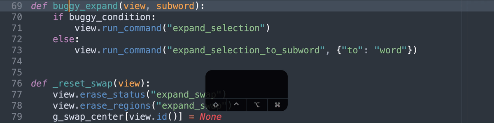

# Expand and Edit

> A Sublime Text plugin that provides a set of 2-in-1 commands that combine `expand` and `edit` commands.



*^ (1) expand and cut (2) expand and copy (3) expand and paste (4) expand and swap.*

All the actions listed below can be done with 1 command

0. Expand to Word/Subword
1. Expand to Word/Subword and Cut
2. Expand to Word/Subword and Copy
3. Expand to Word/Subword and Paste
4. Expand to Word/Subword and Delete
5. Expand to Word/Subword and Displace
6. Expand to Word/Subword and Swap

That is, with just 1 command, you can expand the cursor or selection to the surrounding

- word
- subword

and

- cut
- copy
- paste
- delete
- displace
- swap

## Install

[Package Control](https://packagecontrol.io/packages/Expand%20and%20Edit)

## How to Use

### 1. Key Bindings

No default key bindings. Define your own. For recommended key bindings, open

```
Preferences > Package Settings > Expand and Edit > Key Bindings
```

or enter in the command palette

```
Preferences: Expand and Edit Key Bindings
```

#### Recommended Key Bindings

| Command                       | Windows / Linux                                                                   | macOS                                                                           |
| ----------------------------- | --------------------------------------------------------------------------------- | ------------------------------------------------------------------------------- |
| `Expand Selection to Subword` | <kbd>Alt</kbd> + <kbd>D</kbd>                                                     | <kbd>Opt</kbd> + <kbd>D</kbd>                                                   |
| `Expand Cut Word`             | <kbd>Ctrl</kbd> + <kbd>;</kbd>                                                    | <kbd>Cmd</kbd> + <kbd>;</kbd>                                                   |
| `Expand Cut Subword`          | <kbd>Ctrl</kbd> + <kbd>'</kbd>                                                    | <kbd>Cmd</kbd> + <kbd>'</kbd>                                                   |
| `Expand Copy Word`            | <kbd>Ctrl</kbd> + <kbd>Shift</kbd> + <kbd>;</kbd>                                 | <kbd>Cmd</kbd> + <kbd>Shift</kbd> + <kbd>;</kbd>                                |
| `Expand Copy Subword`         | <kbd>Ctrl</kbd> + <kbd>Shift</kbd> + <kbd>'</kbd>                                 | <kbd>Cmd</kbd> + <kbd>Shift</kbd> + <kbd>'</kbd>                                |
| `Expand Paste Word`           | <kbd>Ctrl</kbd> + <kbd>K</kbd>, <kbd>Ctrl</kbd> + <kbd>Shift</kbd> + <kbd>;</kbd> | <kbd>Cmd</kbd> + <kbd>K</kbd>, <kbd>Cmd</kbd> + <kbd>Shift</kbd> + <kbd>;</kbd> |
| `Expand Paste Subword`        | <kbd>Ctrl</kbd> + <kbd>K</kbd>, <kbd>Ctrl</kbd> + <kbd>Shift</kbd> + <kbd>'</kbd> | <kbd>Cmd</kbd> + <kbd>K</kbd>, <kbd>Cmd</kbd> + <kbd>Shift</kbd> + <kbd>'</kbd> |
| `Expand Delete Word`          | <kbd>Alt</kbd> + <kbd>;</kbd>                                                     | <kbd>Opt</kbd> + <kbd>;</kbd>                                                   |
| `Expand Delete Subword`       | <kbd>Alt</kbd> + <kbd>'</kbd>                                                     | <kbd>Opt</kbd> + <kbd>'</kbd>                                                   |
| `Expand Displace Word`        | <kbd>Ctrl</kbd> + <kbd>Alt</kbd> + <kbd>;</kbd>                                   | <kbd>Cmd</kbd> + <kbd>Opt</kbd> + <kbd>;</kbd>                                  |
| `Expand Displace Subword`     | <kbd>Ctrl</kbd> + <kbd>Alt</kbd> + <kbd>'</kbd>                                   | <kbd>Cmd</kbd> + <kbd>Opt</kbd> + <kbd>'</kbd>                                  |
| `Expand Swap Word`            | <kbd>Ctrl</kbd> + <kbd>K</kbd>, <kbd>Ctrl</kbd> + <kbd>;</kbd>                    | <kbd>Cmd</kbd> + <kbd>K</kbd>, <kbd>Cmd</kbd> + <kbd>;</kbd>                    |
| `Expand Swap Subword`         | <kbd>Ctrl</kbd> + <kbd>K</kbd>, <kbd>Ctrl</kbd> + <kbd>'</kbd>                    | <kbd>Cmd</kbd> + <kbd>K</kbd>, <kbd>Cmd</kbd> + <kbd>'</kbd>                    |
| `Cancel Swap`                 | <kbd>Ctrl</kbd> + <kbd>Esc</kbd>                                                  | <kbd>Cmd</kbd> + <kbd>Esc</kbd>                                                 |

### 2. Main Menu

```
Edit > Expand and ... > Cut Word
Edit > Expand and ... > Cut Subword
Edit > Expand and ... > Copy Word
Edit > Expand and ... > Copy Subword
Edit > Expand and ... > Paste Word
Edit > Expand and ... > Paste Subword
Edit > Expand and ... > Delete Word
Edit > Expand and ... > Delete Subword
Edit > Expand and ... > Displace Word
Edit > Expand and ... > Displace Subword
Edit > Expand and ... > Swap Word
Edit > Expand and ... > Swap Subword
Edit > Cancel Swap
Selection > Expand Selection to Subword
```

### 3. Command Palette

```
Expand Selection to Subword
Expand Cut Word
Expand Cut Subword
Expand Copy Word
Expand Copy Subword
Expand Paste Word
Expand Paste Subword
Expand Delete Word
Expand Delete Subword
Expand Displace Word
Expand Displace Subword
Expand Swap Word
Expand Swap Subword
Cancel Swap
```

### Understanding `Displace`

`Displace` is like `Paste`.

The difference is -- instead of copying content from the clipboard, it exchanges content with the clipboard.

- Before `Displace`

| Clipboard | Target   |
| --------- | -------- |
| `"Bird"`  | `"Fish"` |

- After `Displace`

| Clipboard | Target   |
| --------- | -------- |
| `"Fish"`  | `"Bird"` |

As a comparison

- Before `Paste`

| Clipboard | Target   |
| --------- | -------- |
| `"Bird"`  | `"Fish"` |

- After `Paste`

| Clipboard | Target   |
| --------- | -------- |
| `"Bird"`  | `"Bird"` |

## Author

Aaron Fu Lei

## License

MIT
